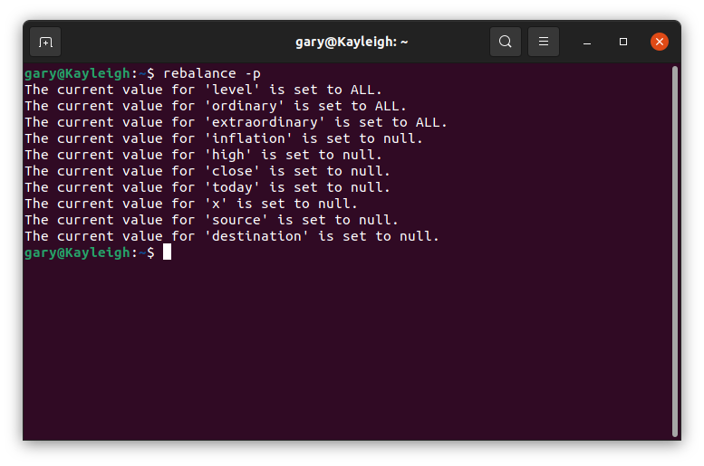
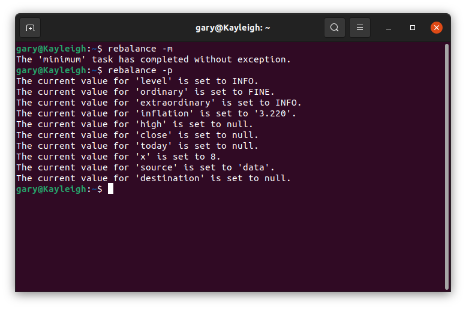
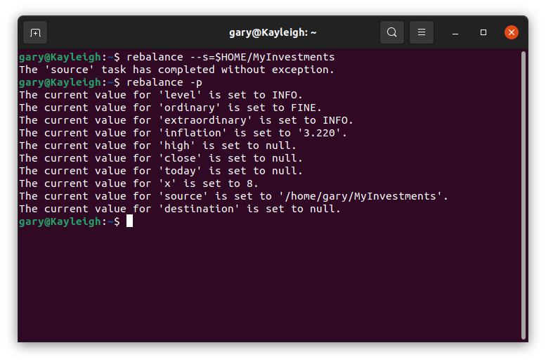
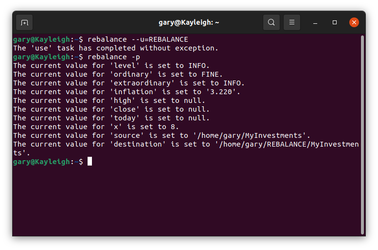
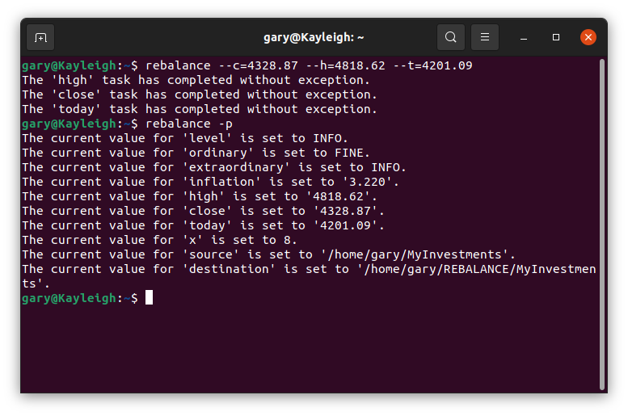

# Rebalance

A Java Project to Rebalance Investment Portfolios

The Rebalance Project is one that I undertook beginning in February 2021. It is a Java-based, command-line software tool that rebalances the investment holdings of one or more investors. While doing so, it also categorizes and sums the assets of each investor. The tool will produce reports that give a complete breakdown of the holdings of the investor, and their net worth. It will also produce instructions for each investor for rebalancing his or her portfolio. 

The tool is currently driven by a series of comma-separated files (CSV's). The tool will rebalance the portfolio holdings of each investor across institutions, accounts, mutual funds, ETFs and individual securities based on declared weight preferences.

Output from the tool is a series of text files for each investor:

1. A report of the current state of the portfolio
2. A report of the state of the portfolio after proposed changes
3. A file that shows currency differences between proposed and current holdings
4. A file that describes the reallocation actions required to effect the proposed changes   

### Motivation

I have been interested in investing and investments for many years, and have sought throughout my professional career to save and invest diligently. During that time, I have periodically undertaken the task of rebalancing my personal investments by hand using spreadsheets and a calculator. I found this to be an imprecise, tedious, and error-prone task. 

### Why this Project?

Beginning at the end of calendar year 2020, I changed my career focus from full-time employment, and contract assignments to a long term status as a freelance software developer and data scientist. In my capacity in this role, I undertook this project for two reasons. First, I desired a mostly automated tool to undertake the chore of rebalancing my investments. Second, I desired to showcase a large, publicly accessible software project that was conceived, designed, coded and documented solely by myself.

In service of both goals, I decided to produce my own custom tool for the task. Another option might have been to use existing commercial software, or an existing open-source project. I rejected a commercial software solution for two reasons, the first being the one-time, or ongoing expense. I also felt commercial software might not be exactly what I needed. I rejected open-source solutions for two reasons, the first being a lack of complete trust in any solution I might discover. The second reason was that I felt my time would be better spent professionally in developing my own software rather than in researching open-source solutions. After all, at the end of the day I could demonstrate a unique, professional accomplishment when developing my own tool.

### Input

The input to the tool is a series of sixteen CSV files that are coded by date as a suffix in their names (format: yyyymmdd). Sample files are located in the data directory of this project. There you will find a series of subdirectories. Some subdirectories contain one or more input files of the same type, differing by date, or one or more output files differing by date.
These sixteen input files are:

1. Account: A description of accounts unique by institution and account number
2. Basis: A hierarchy of expenses used for calculating capital gains tax
3. Code: A description of single-character alphabetic codes used internally by the tool
4. Detailed: Fine-grained weight preferences specific to account
5. Distinguished: Key-value pairs that map programmatically accessible keys to sensitive portfolio keys, institution names, and account numbers
6. Gains Tax Rates (4 files): Current capital gains tax rates, one file for each of head-of-household, joint, separate and single filers
7. Holding: The most important file, a hierarchy of holding valuations organized by portfolios, institutions, accounts, and securities 
8. Income Tax Rates (4 files): Current income tax rates, one file for each of head-of-household, joint, separate and single filers
9. Portfolio: A description of portfolios unique by a key
10. Ticker: A description of tickers unique by key (funds, ETFs or individual security) that describe the type of securities held (e.g., stock, bond, cash or real estate)

As well as sample data files, the reader will also find in each data subdirectory a text file describing in column order the fields in the CSV files of that type. Each row in the CSV files of the given type is assumed to have a unique key. The key field(s) are so indicated in the description file. 

I have left as an enhancement the possibility that input to the tool may be changed to SQL tables indexed by a combination of date, and existing keys in the CSV files. An additional enhancement would be a graphical user interface by which the SQL tables may be edited. The current tool does not have these features.

### State of the Project

After 13 months of work - to the end of February 2022 - I deemed the design, code and deployment activities of the project to be complete. I allocated one man-month to fully document the project for professional showcase. My intention is to complete this work by the conclusion of March 2022. An observer will note progressive activity and growth in this markdown file and related documents during this time. Below you will find some portions of the markdown template that remain unedited. Stop by often for updates!

## Table of Contents

- [Installation](#installation)
- [Usage](#usage)
- [Command Line Options](#command-line-options)
- [Account File](#account-file)
- [Basis File](#basis-file)
- [Code File](#code-file)
- [Detailed File](#detailed-file)
- [Distinguished File](#distinguished-file)
- [Gains Files](#gains-files)
- [Holding File](#holding-file)
- [Income Files](#income-files)
- [Portfolio File](#portfolio-file)
- [Ticker File](#ticker-file)
- [How Does Rebalancing Work?](#how-does-rebalancing-work)
- [Credits](#credits)
- [Warranty](#warranty)
- [License](#license)

## Installation

This project was designed and coded in an Ubuntu Linux environment using the IntelliJ IDE and Java version 11. It should be possible to install and run, or even build the software in a Windows, or MacOS environment. At this time I have decided against investigating the steps required for installing the product in non-Linux environments. You will need the Java 11 JRE to run the software.

Among the releases for this product, you will find the following files:

1. An executable jar containing the software
2. An executable file with a command to start the software
3. The source code as a zip file
4. The source code as a tar file

Download at least the executable jar, and the executable file. Ensure that the executable file has the executable permission set for at least the user of the file. To do this, use a terminal and change directory to the directory containing your download. Then use the command: <pre>chmod u+x rebalance</pre> to set the executable permission. Return to your user home directory, and edit the .bash_alias file to include a line similar to the following:<pre>export PATH={path to your download}:$PATH</pre> and save the file. You will now need to close your terminal, and reopen a new terminal to make the rebalance command available.  

Alternatively, you may build the software locally. You will need a Java JDK of at least version 11. In the directory containing this markdown file, you will find <i>build.xml</i> and <i>build.properties</i> files suitable for building the software using ant. These files were automatically generated using the Ant Build Generation plugin from Jetbrains, version 203.4. I desired to edit these files minimally to create an external build using ant. As such, you will only need to edit the <i>build.properties</i> file locally. See below. 

Clone the repository for this project using a Linux terminal. On the command line, type: <pre>git clone https://github.com/garygr2002/Rebalance.git </pre>

If ant is not installed in your Linux environment, you may install it using the following command: <pre>sudo apt install ant</pre>

The software also uses the jetbrains annotations jar, version 20.1.0. To build the software, you will need to acquire the annotations jar from an IntelliJ installation, or directly from the Internet. Only the jar is required, but it must be available from a relative path of <i>...org/jetbrains/annotations/20.1.0/</i> from where you install it. Call this installation directory '<i>x</i>'. Edit the <i>build.properties</i> file in this directory, and follow the instructions therein to set the <i>path.variable.maven_repository</i> variable with path to your annotations jar, '<i>x</i>'. Set the <i>JDK.home.11</i> variable with the path to your Java 11+ JDK. You should now be ready to build the software using the ant command from a terminal in the directory containing this markdown file in your cloned repository.

## Usage

The software uses Java preferences to maintain persistent settings. Currently, settings are not user-specific. If preferences have not been previously set, you will see something similar to the following terminal window when running the software with the 'p' option: 

Minimum runtime settings are achieved by using the 'm' option, which will set the logging levels and thresholds to sane values. The option will also set the known, long-term inflation percentage, and the rebalance limit for same fund types. Finally, this option sets a default as the source for the data files. You will see something similar to the following terminal window when running the software after the 'm' and 'p' options: 

You may reset the source directory for the data file using the 's' option. The argument to the 's' option must be a valid absolute path, or valid path relative to the current directory. You will see something similar to the following terminal window when running the software after the 's' and 'p' options:

You may set the critical component of the destination directory for backup using the 'u' option. For this option, the home directory of the user is assumed as a prefix, and the final element of the data source directory is assumed as a suffix. You will see something similar to the following terminal window when running the software after the 'u' and 'p' options:

You may set current and historical valuations for the Standard and Poor 500 using the 'c', 'h' and 't' options. These options stand for 'close (last)', 'high' and 'today' respectively. The software uses these settings to automatically adjust investor-specific equity weights given in the portfolio CSV file. The software will make the adjustment for today's valuation of the S&P 500 versus last close for every portfolio. However, an equity adjustment of today's setting versus historical high is a per-portfolio preference. Read further in this document, or explore the description of the CSV files for more information. Please note that it is not required to set valuations for the S&P 500 in order for the software to run correctly. When one or more of these preferences are not set, the software will skip the adjustments. You will see something similar to the following terminal window when running the software after the 'c', 'h', 't' and 'p' options: 

A screen snap is omitted here for the 'b' option, which backs up the current source directory to the current destination directory. As well, a screen snap is omitted here for running the software with no option, which causes the software to rebalance investor portfolios given the current CSV input files.

## Command Line Options

Below find an exhaustive list of command line options. As noted previously, running the software with no option causes it to read input CSV files from the designated source directory, and subdirectories. The software will use the CSV files to rebalance the indicated portfolios, and produce output. For the command line options listed below, any prefix of the full word positively identifies the option. Options may be specified with a single preceding hyphen such the very next token after any intervening whitespace is accepted as an argument. Alternatively, options may be specified with two preceding hyphens such that the user specifies an argument with a connecting equals sign, and no intervening whitespace. Note: If more than one command line option is present, the software evaluates the options, and will set or show a preference in the order given below. In this way, it is possible for a set preference to clobber a preference that was previously set on the same command line. This is a necessary feature, not a bug! Preference are currently global, and not user-specific. 

### -reset

Resets all preferences to defaults. The default is null when null has a meaning for any preference.

### -minimum

Sets all preferences required for the software to run in some fashion. This assumes a default for the source directory for the data files. The default is not assumed to be a directory that exists. The action of this option is different from the 's' command line option, where the explicitly identified argument must be an absolute, or relative directory path that <b>must</b> exist.

### -preference

Lists the current settings for all the preferences.

### -level lglv

Sets the minimum level at which messages appear in the log file. Messages generated by the software below this level will not appear in the log file. The <i>lglv</i> argument may be one of : ALL, CONFIG, FINE, FINER, FINEST, INFO, OFF, SEVERE or WARNING. The argument is required.

### -ordinary rdnr

The logging level for messages the software deems to be "ordinary". The <i>rdnr</i> argument may be one of ALL, CONFIG, FINE, FINER, FINEST, INFO or OFF. The argument is required.

### -extraordinary xtrd

The logging level for messages the software deems to be "extraordinary". The <i>xtrd</i> argument may be one of ALL, CONFIG, FINE, FINER, FINEST, INFO or OFF. The argument is required.

### -inflation fltn

The annual expected rate of inflation, expressed as a percentage. The <i>fltn</i> argument must be a number, possibly with a decimal point, and is required. Among other possible uses, the software uses this value to compute the accumulated value of pensions that have no cost-of-living increase. For this purpose, the software assumes no inflation if this preference has not been set. 

### -high sphg

The record high of the Standard & Poor 500. The <i>sphg</i> argument must be a non-negative number, possibly with a decimal point, and is required. The software will use this value, if set, and the value of the Standard & Poor 500 today (see option, below) to upward-adjust the percentage of a portfolio allocated to equity investments. It will only do this for portfolios that so specify in the portfolio CSV file.

### -close spcl

The last close of the Standard & Poor 500. The <i>spcl</i> argument must be a non-negative number, possibly with a decimal point, and is required. The software will use this value, if set, and the value of the Standard and Poor 500 today (see option, below) to adjust the percentage of equity investment allocations in all portfolios. To skip this adjustment, the user may leave this preference unset.

### -today sptd

The value of the Standard & Poor 500 on the day the software is run. The <i>sptd</i> argument must be a non-negative number, possibly with a decimal point, and is required. The software will use this value, if set, to perform adjustments to the equity investment allocations in all portfolios. It does this in conjunction with the S&P 500 high, and S&P 500 last close preferences previously discussed. Note that if this preference is not set, the software will rely  on per-portfolio specifications for equity weight, and will perform no adjustments. 

### -x ncnt

The <i>ncnt</i> argument must be a non-negative integer, and is required. It is the rebalance limit of same-type investments per account. This takes a little explanation: When a currency value is allocated to a certain "type" of investment (e.g., small capitalization value stocks), the software may not be able to perfectly distribute the amount to the investments in that category. A "perfect" distribution is one that exactly matches - to the penny - the known weight preferences for investments of that type. If the perfect allocation cannot be accomplished, the software will attempt to redistribute the residual to a subset of the investments. It will do this for each possible subset, looking for a subset that minimizes the residual. For minimum residuals, the software will choose an allocation that minimizes the standard deviation from an allocation that perfectly matches the desired weights for the investments in that category. Make sense?  

Why would an allocation not be able to exactly match the specified weights? At the level of individual funds in the account, there are two reasons. First, the fund may have a minimum investment which may not be met with a certain weight allocation. Second, for an ETF or stock, an investment may have a requirement, or preference for some whole or round number of shares that may not be met with a certain weight allocation.

The thing is, checking all the subsets of an investment category in an account requires a runtime that is two to the power of the number of investments in the category. This is prohibitively expensive for even a modest number of investments. A situation where this would come into play would be when an account contains, for example, twenty small cap value stock ETFs, all with a preferred round number of shares. You can see that it will take no small amount of runtime to examine two to the twentieth power of investment subsets. If the number of investments of a certain type exceed this preference, the software will not even try to rebalance them. The alternative is a program that appears to hang indefinitely when run. Note that the software applies this same limit as it works up the tree of same-type investments. At the coarsest level - level one - the software needs a minimum of four in this setting to rebalance equities, bonds, cash and real-estate.

There is a dynamic programming algorithm that can find a best-fit for investments subsets as discussed here. This is faster than exhaustively searching all subsets as is currently done by the software. I will move on to discuss hierarchies of investments types, and the weights assigned to subtypes further in this discussion. In the meantime, you may wish to leave this preference to its reasonable default.

### -source spth

The source directory for the CSV files that this software reads. The source directory must contain the following subdirectories: account, basis, code, detailed, distinguished, gains_head, gains_joint, gains_separate, gains_single, holding, income_head, income_joint, income_separate, income_single, portfolio and ticker. The <i>spth</i> argument may be any valid absolute path, or valid path relative to the current directory. The argument is required.

### -destination dpth

The default destination used by the backup command. See the backup command below. The <i>dpth</i> argument is required.

### -use link

Sets the destination directory to a concatenation of the home directory of the user, followed by the argument, followed by the final element of the existing source path. The <i>link</i> argument is required.

### -backup [bpth]

Backs up the files in the source path. The <i>bpth</i> argument is optional. If not given, the backup command uses the existing destination path preference.

### -assistance

Displays the command line usage text.

## Account File

The account file is one of sixteen CSV files that act as input to the software. Files in this format are located in a subdirectory named "account" located in the directory identified in the source preference. Files of this type have the prefix "account_" followed by a date designation in the format "yyyymmdd", and a file type of ".csv". When run with no command line options, the software will read, and use the account file that has the latest date that is not later than the date of the latest holding file. The account file contains information that is required to identify, characterize, and rebalance accounts. The key for the rows in the file is a concatenation of an institution mnemonic and account number, and the combination of the two should be unique. The following are the fields of an account file row. 

### Institution

The institution mnemonic begins in column 1, and may be up to 12 characters long. Its content is not constrained as long as it is not blank. The institution mnemonic identifies the institution where the account is held.

### Number

The account number begins in column 14, and may be up to 16 characters long. Its content is constrained to a positive integer. The account number uniquely identifies an account within an institution. 

### Rebalance Order

The rebalance order begins at column 31, and may be up to 8 characters long. Its content is constrained to a non-negative integer. The rebalance order is the order in which the software will rebalance the account within a portfolio. I suggest that the rebalance order be a unique integer, but this is not required. If the specified rebalance order is not unique, then the software will rebalance same-portfolio accounts in the order in which they are specified in this file.  

### Name

The account name begins at column 40, and may be up to 42 characters long. Its content is not constrained. The account name is for visual identification purposes, and I suggest it be unique. However, uniqueness is not required. The account name should match the corresponding field in the holding file. The holding file is where the account receives its value.

### Tax Type

The tax type begins at column 83, and may be up to 14 characters long. Its content is constrained to one of the following strings: "Credit", "HSA", "Inherited_IRA", "Non_Roth_401k", "Non_Roth_Annuity", "Non_Roth_IRA", "Pension", "Real_Estate", "Roth_401k", "Roth_Annuity", "Roth_IRA", or "Taxable". Case is not important. The tax type categorizes the tax status of the account. 

### Rebalance Procedure

The rebalance procedure begins at column 98, and may be up to 14 characters long. Its content is constrained to one of the following strings: "Percent" or "Redistribute". Case is not important. The rebalance procedure is used to report what actions to take to rebalance the account. For percent accounts, the software will report percent allocations to funds. For redistribute accounts, the software will report specific currency amounts to shift between funds.

### Weight Equities

The weight equities begins at column 113, and may be up to 6 characters long. Its content is constrained to a non-negative number, possibly with a decimal point. Although conveniently specified as a percent, the value is actually a weight assigned to equity (or stock) investments. If this field, and that for bonds, cash and real estate sum to 100, then the specified weight is actually a percent assigned to equities.

### Weight Bonds

The weight bonds begins at column 120, and may be up to 6 characters long. Its content is constrained to a non-negative number, possibly with a decimal point. Although conveniently specified as a percent, the value is actually a weight assigned to bond investments. If this field, and that for equities, cash and real estate sum to 100, then the specified weight is actually a percent assigned to bonds.

### Weight Cash

The weight cash begins at column 127, and may be up to 6 characters long. Its content is constrained to a non-negative number, possibly with a decimal point. Although conveniently specified as a percent, the value is actually a weight assigned to cash investments (e.g. checking or savings accounts, or CDs). If this field, and that for equities, bonds and real estate sum to 100, then the specified weight is actually a percent assigned to cash.

### Weight Real Estate

The weight cash begins at column 134, and may be up to 6 characters long. Its content is constrained to a non-negative number, possibly with a decimal point. Although conveniently specified as a percent, the value is actually a weight assigned to real estate investments (e.g. real property or shares in a trust). If this field, and that for equities, bonds and cash sum to 100, then the specified weight is actually a percent assigned to real estate.

### Synthesizer Type

The synthesizer type begins at column 141, and may be up to 16 characters long. The field is typically not specified for accounts where the value does not need to be synthesized. Accounts whose value may need to be synthesized include annuities, social security, or pensions. If specified, the content is constrained to one of the following strings: "Averaging", "CPI_Annuity", "Negation", "No_CPI_Annuity", or "Social_Security". Case is not important.

Monthly annuitized payments for CPI-adjusted, No-CPI-adjusted and Social Security are given per-investor in the portfolio file. If the value of the account is not explicitly specified in the holding file, then the software will attempt to synthesize the value of the account using the indicated synthesizer. It will do this based on the monthly payment, the life expectancy of the investor (also given in the portfolio file), and the expected rate of inflation (for no-CPI adjusted annuities).

For accounts that estimate valuations of real estate, the user may create a synthesized account that is the negated sum of the estimates, plus their average. The sum of the synthesized account and all the estimates will produce a single, positive average. This valuation of this type of account is the work of an averaging synthesizer. See the Referenced Accounts field.  

### Referenced Accounts

Referenced accounts begin at column 158, and maybe up to 16 characters long per referenced account. Their content is constrained to positive integers. The referenced accounts may be used by the indicated synthesizer. For example, an averaging synthesizer will need to reference the accounts it is expected to average.  

## Basis File

Note: The rows, fields, and consistency rules stated below are applicable to both the basis file, and the holding file. The basis file contains prices paid for tickers, and the sums of prices paid for all tickers in accounts, institutions and portfolios. The software may use the basis file for calculating capital gains tax. See [Holding File](#holding-file) for a discussion of the holding file.

The basis file is one of sixteen CSV files that act as input to the software. Files in this format are located in a subdirectory named "basis_" followed by a date designation in the format "yyyymmdd", and a file type of ".csv". When run with no command line options, the software will read, and use the basis file that has the latest date that is not later than the date of the latest holding file. The basis file contains a hierarchy of investment bases. At the highest level are portfolios, followed by institutions, followed by accounts, followed by tickers. Each row of the basis file corresponds to one of these, and is coded to indicate its type. The software assumes:

1. All ticker rows are a part of the most recently listed account row
2. All account rows are a part of the most recently listed institution row
3. All institution rows are a part of the most recently listed portfolio row

The software assumes that "orphaned" rows (tickers, accounts or institutions with no parent) are errors, and reports these as such. If the value field of an account is specified, it should match the sum of the ticker rows of the account. If the value field of an institution is specified, it should match the sum of the account rows of the institution. If the value field of a portfolio is specified, it should match the sum of the institution rows of the portfolio. The software will consider it an error if the value field in any row - if provided - does not match the sum of its children.

The key of a basis file entry is the unique concatenation of the key of a parent row and the key of its child. For portfolios, the key would be a distinguished value concatenated with the portfolio mnemonic. For institutions, the key would be the portfolio mnemonic concatenated with an institution mnemonic. For accounts, the key would be the institution mnemonic concatenated with the account number. For tickers, the key would be the account key (institution mnemonic/account number combination) concatenated with the ticker symbol.

The portfolio mnemonic specified in a basis row must match a portfolio file row. The institution mnemonic/account number combination must match an account file row. The ticker symbol must match a ticker file row. The following are the fields of a basis file row.

### Line Type

The line type begins in column 1, and is 1 character. Its content is constrained to one of the following characters: 'A' (an account row), 'F' (a row for a fund available for rebalance), 'I' (an institution row), 'J' (a row for a fund <b><i>not</i>,</b> available for rebalance), 'P' (a portfolio row), 'Q', (a row for a single bond or stock), 'X' (a row for an exchange-trade fund). I hope the use of the line type is self-explanatory.

### Key

The basis key begins in column 3, and may be 16 characters long. Its content is unconstrained as long as it references:

1. A portfolio mnemonic (see [Portfolio File](#portfolio-file)) for rows with a 'P' line type
2. An institution mnemonic (see [Account File](#account-file)) for rows with an 'I' line type
3. An account number (see [Account File](#account-file)) for rows with an 'A' line type
4. A ticker symbol (see [Ticker File](#ticker-file)) for rows with an 'F', 'J', 'Q' or 'X' line type

### Name

The basis name begins in column 20, and may be 42 characters long. Its content is unconstrained, but must match the portfolio name for rows with a 'P' line type, an account name for rows with an 'A' line type, or the ticker name for rows with an 'F, 'J', 'Q', or 'X' line type. Institution names (rows with an 'I' line type) are specified in this file, and nowhere else. These are therefore completely unconstrained, even if they are inconsistent between multiple occurrences in this same file, or the holding file. The software only uses this field for readable in its reports.

### Shares

The basis shares begins in column 63, and may be 18 characters long. Its content is constrained to a non-negative number, possibly with a decimal point. If left blank, the software will attempt to infer the basis shares by dividing the basis value by the basis price, but only if both are specified and the basis price is not zero. The basis shares only has meaning for rows of the 'F', 'J', 'Q' or 'X' types, and should be left blank for 'A', 'I' and 'P' rows. If not blank for 'A', 'I' or 'P' rows, the software may use the basis shares to calculate a basis value that was left blank, but for no other purpose.

### Price

The basis price begins in column 82, and may be 18 characters long. Its content is constrained to a number, possibly with a decimal point. If left blank, the software will attempt to infer the basis price by dividing the basis value by the basis shares, but only if both are specified and the basis shares is not zero. The basis price only has meaning for rows of the 'F', 'J', 'Q' or 'X' types, and should be left blank for 'A', 'I' and 'P' rows. If not blank for 'A', 'I' or 'P' rows, the software may use the basis price to calculate a basis value that was left blank, but for no other purpose.

### Value

The basis value begins in column 101, and may be 18 characters long. Its content is constrained to a number, possibly with a decimal point. If left blank, the software will attempt to infer the basis value by multiplying the basis shares by the basis price, but only if both are specified. If specified, the basis value must:

1. For 'A' rows, match the sum of all 'F', 'J', 'Q' and 'X' rows given as children
2. For 'I' rows, match the sum of all 'A' rows given as children
3. For 'P' rows, match the sum of all 'I' rows given as children

### Weight

The basis weight begins in column 120, and may be 8 characters if specified. Its content is a non-negative number, possibly with a decimal point. For consistency with the similarly-formatted holding file, the software reads the basis weight. However, it currently uses the holding weight for no purpose.

## Code File

-> Enter description for the code file here.

## Detailed File

The detailed file is one of sixteen CSV files that act as input to the software. Files in this format are located in a subdirectory named "detailed" located in the directory identified in the source preference. Files of this type have the prefix "detailed_" followed by a date designation in the format "yyyymmdd", and a file type of ".csv". When run with no command line options, the software will read, and use the detailed file that has the latest date that is not later than the date of the latest holding file. The detailed file contains fine-grained investment category weights for rebalancing accounts. The key for the rows in the file is a concatenation of an institution mnemonic and account number. The combination of the two should be unique, and match a row in the account file. The account name should match that in the account file, but this is not required. The account name is a field in this file only for fast visual identification of the account. It is not used by the software for any purpose.

The level 1 category weights specified in the detailed file - stock, bond, cash, and real-estate - replace these course-grained weights specified in the account file. The user of the software may override these course-grained weights for any number of accounts, and at the same time specify finer-grained category weights levels 2 through 6 using a row in the detailed file. The user may override the weights for any number of rows: no rows, one row, or all the account rows. Rows in the detailed file that match no row in the account file are read, but ignored. If the software seems to be ignoring course-grained weight settings in the account file, the user might first check whether there exists an overriding row in the detailed file. If the software seems to be ignoring fine-grained weight settings in the detailed file, the user might first check whether the institution mnemonic and account number precisely match the target account in the account file. The following are the fields of a detailed file row.

### Institution

The institution mnemonic begins in column 1, and may be up to 12 characters long. Its content is not constrained as long as it is not blank. The institution mnemonic identifies the institution where the account is held.

### Number

The account number begins in column 14, and may be up to 16 characters long. Its content is constrained to a positive integer. The account number uniquely identifies an account within an institution.

### Name

The account name begins at column 31, and may be up to 42 characters long. Its content is not constrained. The account name is for visual identification purposes, and should match the corresponding field in the account file.

### Weight Stock

The stock weight begins in column 74, and may be 6 characters long. Its content is a non-negative number, possibly with a decimal point. Although conveniently specified as a percent, the value is actually a weight assigned to stocks (equities). If this field, and that for other weights in the same rebalance level sum to 100, then the specified weight is actually a percent assigned to stocks. The stock weight is a level 1 weight category.

### Weight Stock Domestic

The domestic stock weight begins in column 81, and may be 6 characters long. Its content is a non-negative number, possibly with a decimal point. Although conveniently specified as a percent, the value is actually a weight assigned to domestic stocks. If this field, and that for other weights in the same rebalance level sum to 100, then the specified weight is actually a percent assigned to domestic stocks. The domestic stock weight is a level 2 weight category under stock investments.

### Weight Stock Foreign

The foreign stock weight begins in column 88, and may be 6 characters long. Its content is a non-negative number, possibly with a decimal point. Although conveniently specified as a percent, the value is actually a weight assigned to foreign stocks. If this field, and that for other weights in the same rebalance level sum to 100, then the specified weight is actually a percent assigned to foreign stocks. The foreign stock weight is a level 2 weight category under stock investments.

### Weight Stock Large

The large stock weight begins in column 95, and may be 6 characters long. Its content is a non-negative number, possibly with a decimal point. Although conveniently specified as a percent, the value is actually a weight assigned to large cap stocks. If this field, and that for other weights in the same rebalance level sum to 100, then the specified weight is actually a percent assigned to large cap stocks. The large stock weight is a level 3 weight category under: 1) domestic stock investments, and; 2) foreign stock investments.

### Weight Stock Not Large

The not-large stock weight begins in column 102, and may be 6 characters long. Its content is a non-negative number, possibly with a decimal point. Although conveniently specified as a percent, the value is actually a weight assigned to medium cap and small cap stocks. If this field, and that for other weights in the same rebalance level sum to 100, then the specified weight is actually a percent assigned to not-large (medium and small cap) stocks. The not-large stock weight is a level 3 weight category under: 1) domestic stock investments, and; 2) foreign stock investments.

### Weight Stock Medium

The medium stock weight begins in column 109, and may be 6 characters long. Its content is a non-negative number, possibly with a decimal point. Although conveniently specified as a percent, the value is actually a weight assigned to medium cap stocks. If this field, and that for other weights in the same rebalance level sum to 100, then the specified weight is actually a percent assigned to medium cap stocks. The medium stock weight is a level 4 weight category under not-large (medium and small cap) stock investments.

### Weight Stock Small

The small stock weight begins in column 116, and may be 6 characters long. Its content is a non-negative number, possibly with a decimal point. Although conveniently specified as a percent, the value is actually a weight assigned to small cap stocks. If this field, and that for other weights in the same rebalance level sum to 100, then the specified weight is actually a percent assigned to small cap stocks. The small stock weight is a level 4 weight category under not-large (medium and small cap) stock investments.

### Weight Stock Growth and Value

The growth-and-value stock weight begins in column 123, and may be 6 characters long. Its content is a non-negative number, possibly with a decimal point. Although conveniently specified as a percent, the value is actually a weight assigned to growth-and-value stocks. If this field, and that for other weights in the same rebalance level sum to 100, then the specified weight is actually a percent assigned to growth-and-value stocks. The growth-and-value stock weight is a level 4 weight category under: 1) large cap stock investments, and; 2) not-large cap stock investments. Alternatively, it is a level 5 weight category under: 1) medium cap stock investments, and; 2) small cap stock investments.

### Weight Stock Growth or Value

The growth-or-value stock weight begins in column 130, and may be 6 characters long. Its content is a non-negative number, possibly with a decimal point. Although conveniently specified as a percent, the value is actually a weight assigned to growth-or-value (one or the other <i>only</i>) stocks. If this field, and that for other weights in the same rebalance level sum to 100, then the specified weight is actually a percent assigned to growth-or-value stocks. The growth-or-value stock weight is a level 4 weight category under: 1) large cap stock investments, and; 2) not-large cap stock investments. Alternatively, it is a level 5 weight category under: 1) medium cap stock investments, and; 2) small cap stock investments.

### Weight Stock Growth

The growth stock weight begins in column 137, and may be 6 characters long. Its content is a non-negative number, possibly with a decimal point. Although conveniently specified as a percent, the value is actually a weight assigned to growth stocks. If this field, and that for other weights in the same rebalance level sum to 100, then the specified weight is actually a percent assigned to growth stocks. The growth stock weight is a level 5 or 6 weight category under growth-or-value stocks depending on the category of that parent.

### Weight Stock Value

The value stock weight begins in column 144, and may be 6 characters long. Its content is a non-negative number, possibly with a decimal point. Although conveniently specified as a percent, the value is actually a weight assigned to value stocks. If this field, and that for other weights in the same rebalance level sum to 100, then the specified weight is actually a percent assigned to value stocks. The value stock weight is a level 5 or 6 weight category under growth-or-value stocks depending on the category of that parent.

### Weight Bond

The bond weight begins in column 151, and may be 6 characters long. Its content is a non-negative number, possibly with a decimal point. Although conveniently specified as a percent, the value is actually a weight assigned to bonds. If this field, and that for other weights in the same rebalance level sum to 100, then the specified weight is actually a percent assigned to bonds. The bond weight is a level 1 weight category.

### Weight Bond Corporate

The corporate bond weight begins in column 158, and may be 6 characters long. Its content is a non-negative number, possibly with a decimal point. Although conveniently specified as a percent, the value is actually a weight assigned to corporate bonds only. If this field, and that for other weights in the same rebalance level sum to 100, then the specified weight is actually a percent assigned to corporate bonds. The corporate bond weight is a level 2 weight category under bond investments.

### Weight Bond Foreign

The foreign bond weight begins in column 165, and may be 6 characters long. Its content is a non-negative number, possibly with a decimal point. Although conveniently specified as a percent, the value is actually a weight assigned to foreign bonds only. If this field, and that for other weights in the same rebalance level sum to 100, then the specified weight is actually a percent assigned to foreign bonds. The foreign bond weight is a level 2 weight category under bond investments.

### Weight Bond Government

The government bond weight begins in column 172, and may be 6 characters long. Its content is a non-negative number, possibly with a decimal point. Although conveniently specified as a percent, the value is actually a weight assigned to government bonds only. If this field, and that for other weights in the same rebalance level sum to 100, then the specified weight is actually a percent assigned to government bonds. The government bond weight is a level 2 weight category under bond investments.

### Weight Bond High Yield

The high-yield bond weight begins in column 179, and may be 6 characters long. Its content is a non-negative number, possibly with a decimal point. Although conveniently specified as a percent, the value is actually a weight assigned to high-yield bonds only. If this field, and that for other weights in the same rebalance level sum to 100, then the specified weight is actually a percent assigned to high-yield bonds. The high-yield bond weight is a level 2 weight category under bond investments.

### Weight Bond Inflation Protected

The inflation-protected bond weight begins in column 186, and may be 6 characters long. Its content is a non-negative number, possibly with a decimal point. Although conveniently specified as a percent, the value is actually a weight assigned to inflation-protected bonds only. If this field, and that for other weights in the same rebalance level sum to 100, then the specified weight is actually a percent assigned to inflation-protected bonds. The inflation-protected bond weight is a level 2 weight category under bond investments.

### Weight Bond Mortgage

The mortgage-backed bond weight begins in column 193, and may be 6 characters long. Its content is a non-negative number, possibly with a decimal point. Although conveniently specified as a percent, the value is actually a weight assigned to mortgage-backed bonds only. If this field, and that for other weights in the same rebalance level sum to 100, then the specified weight is actually a percent assigned to mortgage-backed bonds. The mortgage-backed bond weight is a level 2 weight category under bond investments.

### Weight Bond Short

The short-term bond weight begins in column 200, and may be 6 characters long. Its content is a non-negative number, possibly with a decimal point. Although conveniently specified as a percent, the value is actually a weight assigned to short-term bonds only. If this field, and that for other weights in the same rebalance level sum to 100, then the specified weight is actually a percent assigned to short-term bonds. The short-term bond weight is a level 2 weight category under bond investments.

### Weight Bond Uncategorized

The uncategorized bond weight begins in column 207, and may be 6 characters long. Its content is a non-negative number, possibly with a decimal point. Although conveniently specified as a percent, the value is actually a weight assigned to uncategorized (mixed type) bonds. If this field, and that for other weights in the same rebalance level sum to 100, then the specified weight is actually a percent assigned to uncategorized bonds. The uncategorized bond weight is a level 2 weight category under bond investments.

### Weight Cash

The cash weight begins in column 214, and may be 6 characters long. Its content is a non-negative number, possibly with a decimal point. Although conveniently specified as a percent, the value is actually a weight assigned to cash. If this field, and that for other weights in the same rebalance level sum to 100, then the specified weight is actually a percent assigned to cash. The cash weight is a level 1 weight category.

### Weight Cash Government

The government cash weight begins in column 221, and may be 6 characters long. Its content is a non-negative number, possibly with a decimal point. Although conveniently specified as a percent, the value is actually a weight assigned to government-issued cash only. If this field, and that for other weights in the same rebalance level sum to 100, then the specified weight is actually a percent assigned to government cash. The government cash weight is a level 2 weight category under cash investments. 

### Weight Cash Uncategorized

The uncategorized cash weight begins in column 228, and may be 6 characters long. Its content is a non-negative number, possibly with a decimal point. Although conveniently specified as a percent, the value is actually a weight assigned to uncategorized (mixed type) cash. If this field, and that for other weights in the same rebalance level sum to 100, then the specified weight is actually a percent assigned to uncategorized cash. The uncategorized cash weight is a level 2 weight category under cash investments.

### Weight Real Estate

The real-estate weight begins in column 235, and may be 6 characters long. Its content is a non-negative number, possibly with a decimal point. Although conveniently specified as a percent, the value is actually a weight assigned to real-estate. If this field, and that for other weights in the same rebalance level sum to 100, then the specified weight is actually a percent assigned to real-estate. The real-estate weight is a level 1 weight category.

## Distinguished File

Unless they intend to programmatically modify the software, the [Code File](#code-file) and the distinguished file are two files that a casual user will not need to edit. If you do not need to edit the distinguished file, create an empty file, or borrow the empty example.

The distinguished file is one of sixteen CSV files that act as input to the software. Files in this format are located in a subdirectory named "distinguished" located in the directory identified in the source preference. Files of this type have the prefix "distinguished_" followed by a date designation in the format "yyyymmdd", and a file type of ".csv". When run with no command line options, the software will read, and use the distinguished file that has the latest date that is not later than the date of the latest holding file. The distinguished file maps well-known, non-sensitive mnemonics for portfolios, institutions and accounts to sensitive keys. The programmer/user will then be able to add code that references these mnemonics to a publicly accessible code base without concern that personally sensitive information will be compromised. The distinguished file is a hierarchy. At the highest level are portfolios, followed by institutions, followed by accounts. Each row of the distinguished file corresponds to one of these, and is coded to indicate its type. The software assumes: 

1. All account rows are a part of the most recently listed institution row
2. All institution rows are a part of the most recently listed portfolio row

The software assumes that "orphaned" rows (tickers, accounts or institutions with no parent) are errors, and reports these as such. Before referencing the programmatically accessible mnemonics in the distinguished file, the programmer/user will need to modify the software thusly:

1. For account references, modify the code file: <b>com.garygregg.rebalance.distinguished.DistinguishedAccount.java</b>, and add the needed mnemonic
2. For institution references,  modify the code file: <b>com.garygregg.rebalance.distinguished.DistinguishedInstitution.java</b>, and add the needed mnemonic
3. For portfolio references,  modify the code file: <b>com.garygregg.rebalance.distinguished.DistinguishedPortfolio.java</b>, and add the needed mnemonic

Once the programmer/user accomplishes this, the added mnemonic may then be referenced using the <b>Distinguished Key</b> field in a row in the distinguished file. The values for the keys will then be programmatically accessible from the <b>DistinguishedAccountLibrary</b>, <b>DistinguishedInstitutionLibrary</b>, or the <b>DistinguishedPortfolioLibrary</b>, depending on the type of distinguished key identified by the line type. The following are the fields of a distinguished file row.

### Line Type

The line type begins in column 1, and is 1 character. Its content is constrained to one of the following characters: 'A' (an account row), 'I' (an institution row), or 'P' (a portfolio row). The line code distinguishes the type of row.

### Distinguished Key

The distinguished key begins in column 3, and is up to 24 characters long. Its content is constrained to one of the case-insensitive mnemonics in the <b>DistinguishedAccount</b>, <b>DistinguishedInstitution</b>, or <b>DistinguishedPortfolio</b> classes, as discussed above. The universal of acceptable strings in this field is governed by the line type. 

### Distinguished Value

The distinguished value begins in column 28, and is up to 52 characters long. Its content is constrained to the type of key required for accounts, institutions, or portfolios, depending on the line type. The distinguished value is a sensitive key that will appear in the distinguished file and referenced in other CSV files, but need not appear in any publicly accessible code base.

## Gains Files

-> Enter description for the capital gains tax rate files here.

## Holding File

Note: The rows, fields, and consistency rules stated below are applicable to both the basis file, and the holding file. The holding file contains valuations of accounts and tickers as of the date of the file. See [Basis File](#basis-file) for a discussion of the basis file.  

The holding file is one of sixteen CSV files that act as input to the software. Files in this format are located in a subdirectory named "holding_" followed by a date designation in the format "yyyymmdd", and a file type of ".csv". When run with no command line options, the software will read, and use the holding file that has the latest date. The holding file contains a hierarchy of investment valuations. At the highest level are portfolios, followed by institutions, followed by accounts, followed by tickers. Each row of the holding file corresponds to one of these, and is coded to indicated its type. The software assumes:

1. All ticker rows are a part of the most recently listed account row
2. All account rows are a part of the most recently listed institution row
3. All institution rows are a part of the most recently listed portfolio row

The software assumes that "orphaned" rows (tickers, accounts or institutions with no parent) are errors, and reports these as such. If the value field of an account is specified, it should match the sum of the ticker rows of the account. If the value field of an institution is specified, it should match the sum of the account rows of the institution. If the value field of a portfolio is specified, it should match the sum of the institution rows of the portfolio. The software will consider it an error if the value field in any row - if provided - does not match the sum of its children. 

The key of a holding file entry is the unique concatenation of the key of a parent row and the key of its child. For portfolios, the key would be a distinguished value concatenated with the portfolio mnemonic. For institutions, the key would be the portfolio mnemonic concatenated with an institution mnemonic. For accounts, the key would be the institution mnemonic concatenated with the account number. For tickers, the key would be the account key (institution mnemonic/account number combination) concatenated with the ticker symbol. 

The portfolio mnemonic specified in a holding row must match a portfolio file row. The institution mnemonic/account number combination must match an account file row. The ticker symbol must match a ticker file row. The following are the fields of a holding file row. 

### Line Type

The line type begins in column 1, and is 1 character. Its content is constrained to one of the following characters: 'A' (an account row), 'F' (a row for a fund available for rebalance), 'I' (an institution row), 'J' (a row for a fund <b><i>not</i>,</b> available for rebalance), 'P' (a portfolio row), 'Q', (a row for a single bond or stock), 'X' (a row for an exchange-trade fund). I hope the use of the line type is self-explanatory.

### Key

The holding key begins in column 3, and may be 16 characters long. Its content is unconstrained as long as it references:

1. A portfolio mnemonic (see [Portfolio File](#portfolio-file)) for rows with a 'P' line type
2. An institution mnemonic (see [Account File](#account-file)) for rows with an 'I' line type
3. An account number (see [Account File](#account-file)) for rows with an 'A' line type
4. A ticker symbol (see [Ticker File](#ticker-file)) for rows with an 'F', 'J', 'Q' or 'X' line type

### Name

The holding name begins in column 20, and may be 42 characters long. Its content is unconstrained, but must match the portfolio name for rows with a 'P' line type, an account name for rows with an 'A' line type, or the ticker name for rows with an 'F, 'J', 'Q', or 'X' line type. Institution names (rows with an 'I' line type) are specified in this file, and nowhere else. These are therefore completely unconstrained, even if they are inconsistent between multiple occurrences in this same file, or the basis file. The software only uses this field for readable in its reports. 

### Shares

The holding shares begins in column 63, and may be 18 characters long. Its content is constrained to a non-negative number, possibly with a decimal point. If left blank, the software will attempt to infer the holding shares by dividing the holding value by the holding price, but only if both are specified and the holding price is not zero. The holding shares only has meaning for rows of the 'F', 'J', 'Q' or 'X' types, and should be left blank for 'A', 'I' and 'P' rows. If not blank for 'A', 'I' or 'P' rows, the software may use the holding shares to calculate a holding value that was left blank, but for no other purpose. 

### Price

The holding price begins in column 82, and may be 18 characters long. Its content is constrained to a number, possibly with a decimal point. If left blank, the software will attempt to infer the holding price by dividing the holding value by the holding shares, but only if both are specified and the holding shares is not zero. The holding price only has meaning for rows of the 'F', 'J', 'Q' or 'X' types, and should be left blank for 'A', 'I' and 'P' rows. If not blank for 'A', 'I' or 'P' rows, the software may use the holding price to calculate a holding value that was left blank, but for no other purpose.

### Value

The holding value begins in column 101, and may be 18 characters long. Its content is constrained to a number, possibly with a decimal point. If left blank, the software will attempt to infer the holding value by multiplying the holding shares by the holding price, but only if both are specified. If specified, the holding value must:

1. For 'A' rows, match the sum of all 'F', 'J', 'Q' and 'X' rows given as children
2. For 'I' rows, match the sum of all 'A' rows given as children
3. For 'P' rows, match the sum of all 'I' rows given as children

### Weight

The holding weight begins in column 120, and may be 8 characters if specified. Its content is a non-negative number, possibly with a decimal point. The holding weight is the value the software will use when rebalancing the holding identified by the current row with other holdings of exactly the same type in the same account. The software assumes a default weight of one, meaning the software will equally distribute value to same-type holdings in the same account if the weight is not explicitly specified for any. A convenient way to withhold value from any holding during rebalance is to set the content of its holding weight to zero. 

## Income Files

-> Enter description for the income tax rate files here.

## Portfolio File

The portfolio file is one of sixteen CSV files that act as input to the software. Files in this format are located in a directory named "portfolio" located in the directory identified in the source preference. Files of this type have the prefix "portfolio_" followed by a date designation in the format "yyyymmdd", and a file type of ".csv". When run with no command line options, the software will read, and use the portfolio file that has the latest date that is not later than the date of the latest holding file. The portfolio contains information that is required to identify, valuate and rebalance portfolios. The key for the rows in the file is a mnemonic that should uniquely identify the investor associated with the portfolio. The following are the fields of a portfolio file row.

### Mnemonic

The portfolio mnemonic begins in column 1, and may be 16 characters long. Its content is not constrained as long as it is not blank. The portfolio mnemonic uniquely identifies the investor associated with the portfolio. 

### Name

The investor name begins in column 18, and may be 20 characters long. Its content is not constrained. The software uses the investor name (rather than the investor mnemonic) in portfolio report files to make those files more readable. The investor name should match the corresponding field in the holding file. The holding file is where the portfolio receives its value.

### Birthdate

The investor birthdate begins in column 39, and is 10 characters long. Its content must be in the format yyyy-mm-dd, the year, month and day of the investor's birth. The software uses this date to determine the investor's earliest eligibility for Social Security.

### Mortality Date

The investor mortality date begins in column 50, and is 10 characters long. Its content must be in the format yyyy-mm-dd, the year, month and day of the investor's estimated mortality date. I recommend using Social Security life expectancy tables and a date calculator to determine this date. The software uses this date to determine the value of annuities, pensions and Social Security.

### Filing Status

The filing status begins in column 61, and is 8 characters long. Its content is constrained to one of the following strings: "Head", "Joint", "Separate", or "Single". Case is not important. The filing status characterizes the income tax filing status of the investor. The possible values mean, respectively: head-of-household, married-filing-jointly, married-filing-separately, or single. The software uses the filing status to determine income tax and capital gains tax, as necessary. 

### Social Security

The monthly Social Security income begins in column 70, and may be up to 8 characters long. Its content is constrained to a non-negative number, possibly with a decimal point. The monthly Social Security income is either: 1) the anticipated Social Security benefit beginning at investor age 62, or; 2) the known benefit as of the current date. The software will use the latter of the two dates, as necessary. If the holding file does not specify an explicit valuation for a Social Security account, the software will synthesize the total value of Social Security using this amount, as well as the birthdate and expected mortality date of the investor. 

### CPI Adjusted

The monthly CPI adjusted income begins in column 79, and may be up to 8 characters long. Its content is constrained to a non-negative number, possibly with a decimal point. The monthly CPI adjusted income is the total CPI adjusted annuity and/or pension income of the investor. The software assumes the income is current, and will continue through the lifetime of the investor. If the holding file does not specify an explicit valuation for a CPI adjusted account, the software will synthesize the total value of the annuity/pension income using this amount and the expected mortality date of the investor.

### Non-CPI Adjusted

The monthly non-CPI adjusted income begins in column 88, and may be up to 8 characters long. Its content is constrained to a non-negative number, possibly with a decimal point. The monthly non-CPI adjusted income is the total non-CPI adjusted annuity and/or pension income of the investor. The software assumes the income is current, and will continue through the lifetime of the investor. If the holding file does not specify an explicit valuation for a non-CPI adjusted account, the software will synthesize the total value of the annuity/pension income using this amount and the expected mortality date of the investor. It will also use the expected annual rate of inflation to reduce the real purchasing value of the monthly benefit over time.      

### Taxable Income

The annual taxable income begins in column 97, and may be up to 10 characters long. Its content is constrained to a non-negative number, possibly with a decimal point. The software uses the annual taxable income for calculating income and capital gains tax, where necessary, and in portfolio reports.

### Weight Equities

The weight equities begins at column 108, and may be up to 6 characters long. Its content is constrained to a non-negative number, possibly with a decimal point. Although conveniently specified as a percent, the value is actually a weight assigned to equity (or stock) investments. If this field, and that for bonds, cash and real estate sum to 100, then the specified weight is actually a percent assigned to equities.

### Weight Bonds

The weight bonds begins at column 115, and may be up to 6 characters long. Its content is constrained to a non-negative number, possibly with a decimal point. Although conveniently specified as a percent, the value is actually a weight assigned to bond investments. If this field, and that for equities, cash and real estate sum to 100, then the specified weight is actually a percent assigned to bonds.

### Weight Cash

The weight cash begins at column 122, and may be up to 6 characters long. Its content is constrained to a non-negative number, possibly with a decimal point. Although conveniently specified as a percent, the value is actually a weight assigned to cash investments (e.g. checking or savings accounts, or CDs). If this field, and that for equities, bonds and real estate sum to 100, then the specified weight is actually a percent assigned to cash.

### Weight Real Estate

The weight cash begins at column 129, and may be up to 6 characters long. Its content is constrained to a non-negative number, possibly with a decimal point. Although conveniently specified as a percent, the value is actually a weight assigned to real estate investments (e.g. real property or shares in a trust). If this field, and that for equities, bonds and cash sum to 100, then the specified weight is actually a percent assigned to real estate.

### Adjust from High

The adjust-from-high flag begins at column 136, and may be up to 6 characters long. Its content is constrained to one of the following strings: "False", or "True". Case is not important. The adjust-from-high flag indicates to the software whether it should make an upward-revision of the preferred equity weight of the portfolio based on a ratio of today's value of the S&P 500 versus the high of the index. We assume by definition that the value of the S&P 500 today cannot be higher than its high. While the software will always make an equity weight adjustment for the ratio of the S&P 500 today versus its last close (assuming these preferences are both set), it will skip an additional today-versus-high adjustment on a per-portfolio basis if this flag is not set. Note that the user may skip all equity adjustments by simply not setting the preference for S&P 500 today. See the command line option -t.   

## Ticker File

The ticker file is one of sixteen CSV files that act as input to the software. Files in this format are located in a directory named "ticker" located in the directory identified in the source preference. Files of this type have the prefix "ticker_" followed by a date designation in the format "yyyymmdd", and a file type of ".csv". When run with no command line options, the software will read, and use the ticker file that has the latest date that is not later than the date of the latest holding file. The ticker contains information that is required to identify and categorize investments by type. "Tickers" is a catch-all name for open-end mutual funds, exchange-traded funds, individual stocks, individual bonds, or any sub-grouping of holding that occurs within an account. The key for the rows in the file is a mnemonic that should uniquely identify the investment in the institution where the ticker exists, or on the exchanges where it trades. It can also be a unique mnemonic that has meaning only to the investor who owns the account. Tickers may appear in one or more accounts in the holding file with valuations that are not the same. The following are the fields of a ticker file row.  

### Code

The ticker code begins in column 1, and is 1 character. Its content is constrained to one of the following characters: 'F' (a fund that is available for rebalance), 'J' (a fund that is not available for rebalance), 'Q' (a single stock or bond), or 'X' (an exchange traded fund). I hope the use of the code is self-explanatory. The software assumes single stocks or bonds are not available for rebalance, but it assumes exchange-traded funds (ETFs) <b><i>are</i></b> available for rebalance.

### Ticker

The ticker symbol begins in column 3, and may be up to 5 characters long. Its content is unconstrained as long as it is not blank. The symbol uniquely identifies the ticker in the institution where it exists, or on an exchange where it trades. It can also be a unique mnemonic that has meaning only to the investor that holds it. Securities can be sub-grouped and categorized within an account using ticker symbols.

### Number

The ticker number begins in column 9, and may be up to 4 characters long. Its content is constrained to a non-negative integer. This number may uniquely identify the ticker within some institutions, but its existence and meaning is not assumed to be universal at all institutions. Assuming a ticker number does not exist, I recommend the user make up a unique ticker number to pair with the symbol. The software only uses the ticker number to help identify tickers in rebalance reports.   

### Name

The ticker name begins in column 14, and may be up to 42 characters long. Its content is not constrained. The ticker name helps identify the ticker in rebalance reports. I recommend that the name be unique, and describe the ticker in an identifiable way. The ticker name should match the corresponding field in the holding file. The holding file is where the ticker receives its value.

### Minimum

The minimum investment begins in column 58, and is up to 10 characters long. Its content is constrained to a number, possibly with a decimal point. The ticker minimum is a currency-denominated minimum investment in the ticker. In its effort to rebalance an account, the software will place either no value in any ticker, or not less than this minimum. Non-balanceable debts may be specified with a negative minimum, which we assume to be a credit limit. Although some institutions place limitations only on initial investments in a fund, the software currently assumes that minimums are applicable to all future transfers into, or out of a fund. An investor may also arbitrarily opt for a self-imposed minimum in any fund. Use this field to do that. 

### Preferred Rounding

The preferred rounding begins in column 69, and is up to 8 characters long. Its content is constrained to a non-negative number, possibly with a decimal point. The preferred rounding is the round number of shares the software will choose for any ticker. Some institutions will require that ETFs be purchased or sold in whole shares, for example. As well, I myself typically like to trade ETFs or stocks in lots of 5 shares. Use this field to make a specification for preferred, or required rounding of shares in the ticker. 

### Subcode 1

The first subcode field begins in column 78, and is one character. Its content is constrained to one of the following characters indicating fund type characteristic:

1. '_' (placeholder for no entry)
2. 'B' (all bonds)
3. 'C' (all cash, e.g. bank accounts, CDs, or money-market funds)
4. 'D' (domestic securities)
5. 'E' (mortgage-baked securities)
6. 'G' (growth stocks)
7. 'H' (inflation protected securities)
8. 'K' (both growth and value stocks)
9. 'L' (large cap stocks)
10. 'M' (medium cap stocks)
11. 'N' (medium and small cap stocks)
12. 'O' (foreign securities)
13. 'P' (investor-specific non-balanceable investment project)
14. 'R' (all real estate)
15. 'S' (all stocks)
16. 'T' (corporate bonds)
17. 'U' (treasury securities)
18. 'V' (value stocks)
19. 'W' (small cap stocks)
20. 'Y' (high-yield bonds)
21. 'Z' (short-term bonds)

The first subcode, in conjunction with the subcodes two, three and four determine the characteristics of the securities holding(s) of the ticker. The software checks for inconsistencies between the various subcodes, and reports an error in its log if inconsistencies exist. For example, a stock ticker cannot hold corporate bonds, etc.  

Currently, the software does not accept blended, or multi-asset funds for rebalance. The user may specify these types of tickers with a code of 'J' (unbalanceable) so that software will take them into account when valuing an account or portfolio. However, it will not attempt to rebalance such a ticker within its account. The software would report an inconsistency if a stock and bond blended fund - or ETF - were designated as balanceable with both the 'B' and 'S' subcodes. 

A use of subcodes one through four may be demonstrated as follows: A large cap growth fund - holding domestic securities - may be specified with the subcodes 'S', 'D', 'L' and 'G'. This completely specifies the balanceable characteristics of the ticker in a way that is possible, and consistent. Currently, the software requires no more than four subcodes to completely characterize a ticker for its rebalancing effort.

### Subcode 2

The second subcode begins in column 80, and is one character. Its content is constrained to one of the characters described in the first subcode. The second subcode, in conjunction with subcodes one, three and four determine the characteristics of the securities holding(s) of the ticker. The software checks for inconsistencies between the various subcodes, and reports an error in its log if inconsistencies exist. For example, a stock ticker cannot hold corporate bonds, etc.

### Subcode 3

The third subcode begins in column 82, and is one character. Its content is constrained to one of the characters described in the first subcode. The third subcode, in conjunction with subcodes one, two and four determine the characteristics of the securities holding(s) of the ticker. The software checks for inconsistencies between the various subcodes, and reports an error in its log if inconsistencies exist. For example, a stock ticker cannot hold corporate bonds, etc.

### Subcode 4

The fourth subcode begins in column 84, and is one character. Its content is constrained to one of the characters described in the first subcode. The fourth subcode, in conjunction with subcodes one, two and three determine the characteristics of the securities holding(s) of the ticker. The software checks for inconsistencies between the various subcodes, and reports an error in its log if inconsistencies exist. For example, a stock ticker cannot hold corporate bonds, etc.

## How Does Rebalancing Work?

This is a stub for the How Does Rebalancing Work section. Here I will discuss levels of investment category, from least specific (lower), to most specific (higher). I will also discuss how the software treats individual holdings the same as investment categories when reallocating value.

## Credits

I selfishly credit only myself with the design, coding and documentation of this project.

## Warranty

No warranty, or guarantee of the correctness or suitability of this product for any purpose is given, either explicitly or implicitly. I have used the software for my own purposes, but it has not been exhaustively tested. Use at your own risk. Feedback and bug reports are welcome!

## License

License of this project and the resulting tool is covered by the GNU General Public License v3.0.
